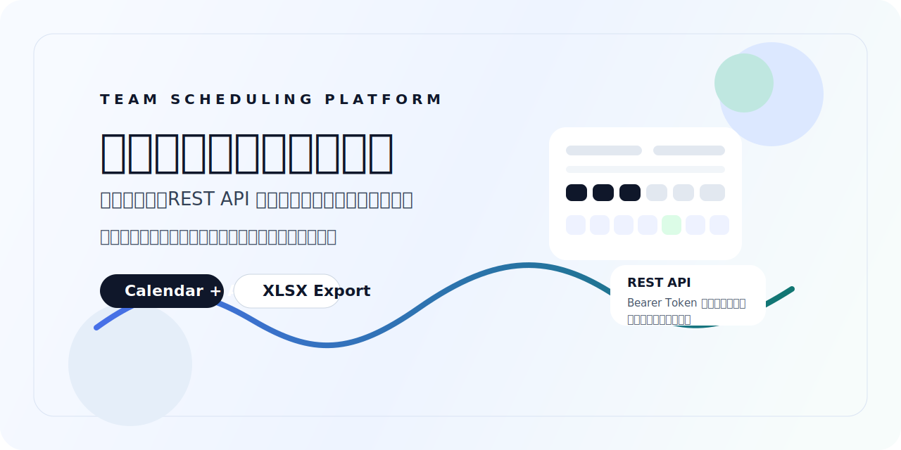
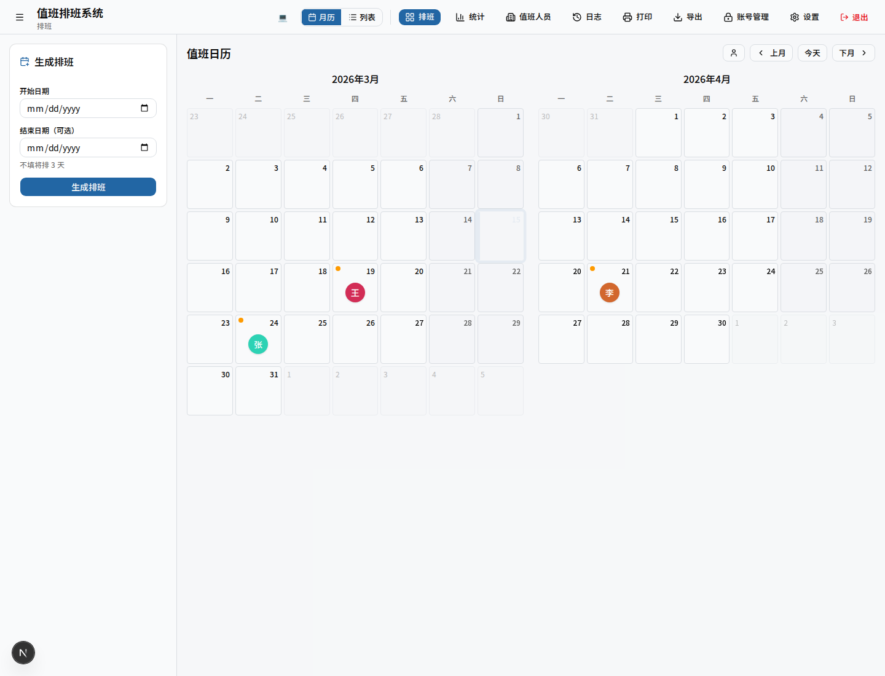
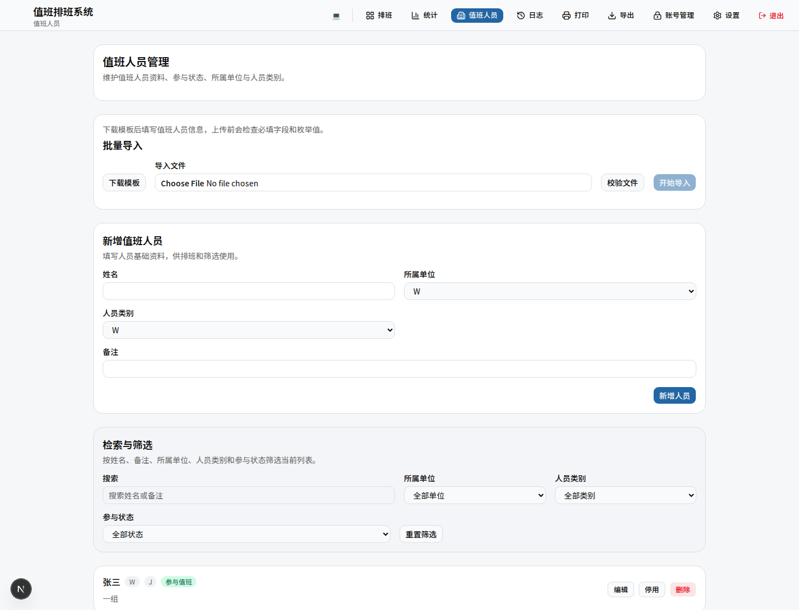
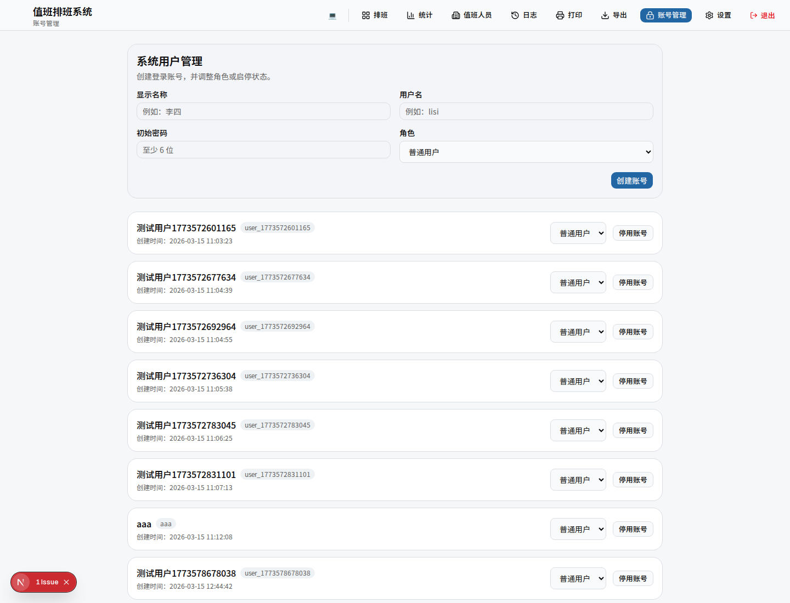
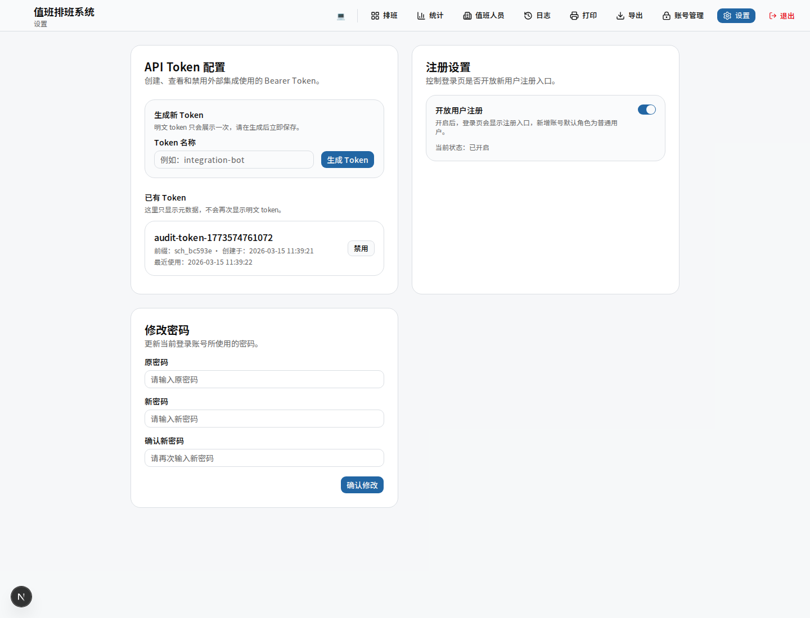
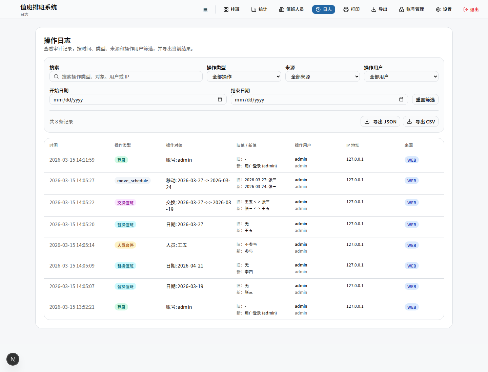

<p align="center">
  
</p>

<p align="center">
  <a href="https://github.com/zweien/scheduling/stargazers"></a>
  <a href="https://github.com/zweien/scheduling/network/members"></a>
  <a href="https://github.com/zweien/scheduling/blob/master/LICENSE"></a>
</p>

<p align="center">
  
  
  
  
  
  
</p>

<p align="center">
  一个面向团队内部使用的值班排班系统，覆盖月历排班、值班人员管理、审计日志、REST API、批量导入与多格式导出。
</p>

适合内部值班、轮岗与轻量排班协作场景，重点解决排班生成、人工调整、集成对接和审计追踪这四类问题。

## 核心能力

- 双月月历与列表双视图，便于连续查看和值班回溯
- 管理员 / 普通用户双角色权限模型，支持注册开关和账号管理
- 值班人员独立管理页面，支持单位、类别、备注、启停、筛选和批量导入
- 月历支持桌面拖拽交换，也支持移动端“移动模式”调整排班
- 审计日志记录操作用户、角色、IP 和来源，支持筛选、搜索、导出
- 提供 Bearer Token 保护的 REST API，适合第三方系统查询与修改排班
- 支持 CSV、JSON、XLSX 导出，其中 XLSX 为月历风格，便于打印和归档

## 系统截图

### 登录与排班

| 登录页 | 月历主界面 |
| --- | --- |
|  |  |

### 人员与账号

| 值班人员管理 | 账号管理 |
| --- | --- |
|  |  |

### 设置与审计

| 设置页 | 审计日志 |
| --- | --- |
|  |  |

## 适用场景

- 团队内部值班、轮岗、运维排班
- 需要保留人工调整记录和责任追踪的小团队
- 需要通过 API 与外部系统打通的内部工具
- 需要批量维护值班人员和定期导出归档的管理场景

## 功能概览

| 能力 | 说明 |
| --- | --- |
| 自动排班 | 按顺序循环生成指定时间范围的值班安排 |
| 月历视图 | 同时展示当前月与下个月，支持点击调整和移动端移动模式 |
| 列表视图 | 以时间线方式查看排班详情 |
| 手动调整 | 支持换人、删除、交换、移动到空日期 |
| 值班人员管理 | 支持单位、类别、备注、启停、搜索、筛选 |
| 批量导入 | 提供 XLSX 模板下载，导入前校验字段，按姓名更新或新增 |
| 账号与权限 | 管理员和普通用户双角色，支持注册开关 |
| 审计日志 | 记录操作用户、角色、IP、来源，并支持搜索筛选导出 |
| REST API | Bearer Token 鉴权的排班、人员、Token 管理接口 |
| 导出能力 | 支持 CSV、JSON 与月历风格 XLSX |

## 快速开始

### 环境要求

- Node.js 20+
- npm

### 安装依赖

```bash
git clone https://github.com/zweien/scheduling.git
cd scheduling
npm install
```

### 本地运行

```bash
npm run dev
```

默认访问：

- `http://localhost:3000`

### 首次登录

系统会自动初始化一个默认管理员账号：

- 用户名：`admin`
- 密码：沿用系统配置中的初始密码

首次初始化数据库时，默认密码为：

- `123456`

如果本地数据库已经存在并被修改过，请以数据库中的当前密码为准。

### 可选环境变量

```env
SESSION_SECRET=your-secret-key-at-least-32-characters
```

### 生产构建

```bash
npm run build
npm run start
```

## 登录与权限模型

当前系统使用账号密码登录，而不是共享密码模式。

角色分为两类：

- `admin`
  - 管理值班人员
  - 管理系统账号
  - 生成和修改排班
  - 管理 API Token
  - 控制注册开关
- `user`
  - 查看排班、统计、日志
  - 使用打印和导出
  - 修改自己的密码

注册页可由管理员在设置页中开启或关闭。开启后，新注册用户默认角色为普通用户。

## 值班人员批量导入

值班人员管理页支持批量导入 `.xlsx` 文件。

导入流程：

1. 下载模板
2. 按模板填写人员信息
3. 上传后先做字段校验
4. 校验通过后再执行导入

模板字段：

- `姓名（必填）`
- `所属单位（必填，W/X/Z）`
- `人员类别（必填，J/W）`
- `是否参与值班（必填，是/否）`
- `备注（选填）`

导入规则：

- 按姓名判重
- 同名存在则更新
- 同名不存在则新增
- 任意错误都会阻止导入

## REST API

当前版本提供基于 Bearer Token 的最小集成能力。

### 鉴权方式

```http
Authorization: Bearer <your-token>
```

### 查询排班

```bash
curl "http://localhost:3000/api/schedules?start=2026-03-01&end=2026-03-31" \
  -H "Authorization: Bearer <your-token>"
```

### 查询人员

```bash
curl "http://localhost:3000/api/users" \
  -H "Authorization: Bearer <your-token>"
```

### 修改指定日期排班

```bash
curl -X PATCH "http://localhost:3000/api/schedules/2026-03-16" \
  -H "Authorization: Bearer <your-token>" \
  -H "Content-Type: application/json" \
  -d '{"userId":2}'
```

### Token 管理接口

- `GET /api/tokens`
- `POST /api/tokens`
- `PATCH /api/tokens/:id`

## 审计与导出

### 审计日志

日志页支持：

- 按日期范围筛选
- 按操作类型筛选
- 按来源筛选
- 按操作用户筛选
- 按关键字搜索
- 导出当前结果为 CSV / JSON

### 排班导出

当前支持三种格式：

- `CSV`
- `JSON`
- `XLSX`

XLSX 输出特性：

- 每个月一个 sheet
- 周一到周日 7 列布局
- 单元格显示日期、值班人、手动调整标记
- 适合 A4 横向打印和归档

## 部署

项目当前提供基于 `GitHub Actions + VPS + PM2 + Nginx` 的部署方案。

部署文档：

- [VPS 部署说明](docs/deployment/vps.md)

如果只想本地运行或内网部署，SQLite 已足够支撑小团队使用。

## 技术栈

- **框架：** Next.js 16 App Router
- **语言：** TypeScript
- **UI：** Tailwind CSS v4 + Base UI
- **数据库：** SQLite + better-sqlite3
- **认证：** iron-session
- **Excel：** ExcelJS
- **日期处理：** date-fns
- **测试：** Playwright + ESLint

## 项目结构

```text
src/
├── app/
│   ├── actions/              # Server Actions
│   ├── api/                  # REST API routes
│   ├── dashboard/            # Dashboard 各独立功能页面
│   ├── register/             # 注册页
│   ├── layout.tsx            # 根布局
│   └── page.tsx              # 登录入口页
├── components/
│   ├── ui/                   # 基础 UI 组件
│   └── *.tsx                 # 业务组件
├── lib/
│   ├── accounts.ts           # 系统账号模型
│   ├── auth.ts               # 登录与权限校验
│   ├── db.ts                 # SQLite 初始化与迁移
│   ├── logs.ts               # 审计日志
│   ├── schedules.ts          # 排班读写
│   ├── users.ts              # 值班人员管理
│   ├── export/               # 导出构建器
│   └── imports/              # 导入模板与解析
└── types/
    └── index.ts              # 领域类型
```

## License

MIT
