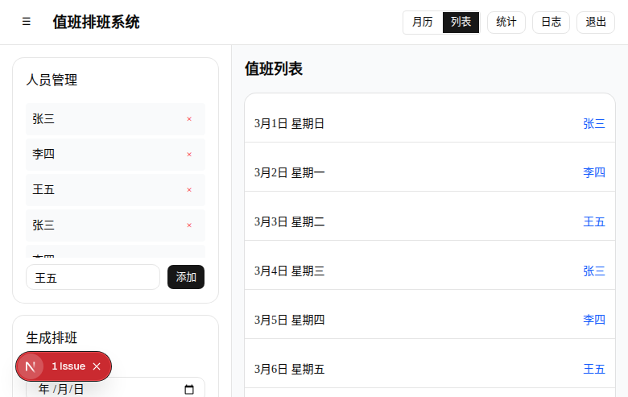
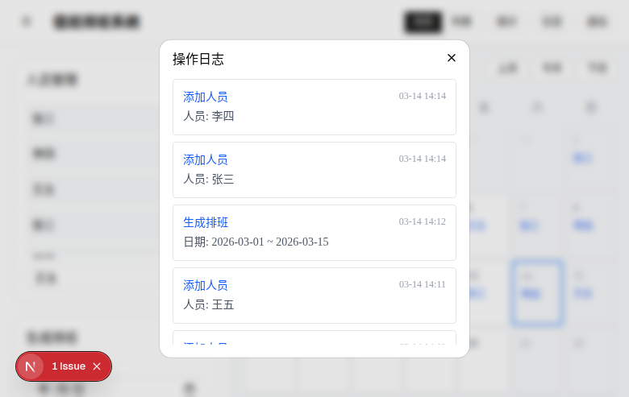
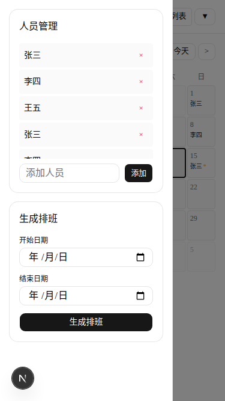
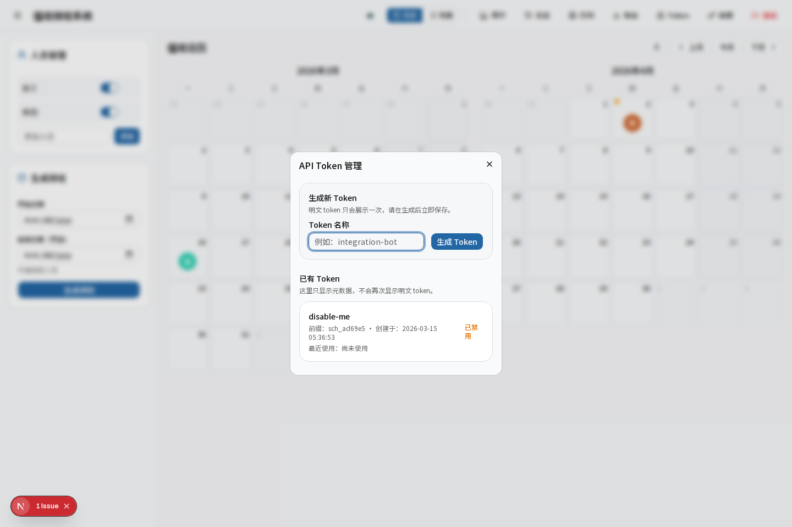

# 值班排班系统

一个面向小团队的值班排班应用，提供月历排班、列表查看、统计分析、日志追踪、REST API 集成与多格式导出，适合内部值班、轮岗与轻量排班协作场景。

## 为什么使用它

- 自动排班，减少手工维护成本
- 月历与列表双视图，适合不同查看习惯
- 支持点击替换和拖拽交换，调整成本低
- 内置统计分析与操作日志，方便追踪排班变更
- 提供 Bearer Token 保护的 REST API，便于系统集成
- 支持月历风格 XLSX 导出，直接适配打印场景
- 基于 SQLite，部署简单，适合团队内部快速落地

## 功能概览

| 能力 | 说明 |
| --- | --- |
| 自动排班 | 按顺序循环生成指定时间范围的值班安排 |
| 月历视图 | 同时展示当前月与下个月，便于连续查看 |
| 列表视图 | 以时间线方式查看排班详情 |
| 手动调整 | 支持按日期替换值班人，或拖拽交换两个日期的排班 |
| 统计分析 | 按人员统计值班次数，并查看日期明细 |
| 操作日志 | 记录生成、替换、交换、登录等关键操作 |
| REST API | 通过 Bearer Token 查询排班、人员并更新指定日期排班 |
| Token 管理 | 在 Web 控制台内生成和禁用 API Token |
| 人员管理 | 支持添加、删除、排序、启用/停用人员 |
| 主题切换 | 支持亮色与暗色模式 |
| 数据导出 | 支持 CSV、JSON 与月历风格 XLSX 导出 |

## 系统截图

### 登录与主界面

| 登录页 | 主控制台 |
| --- | --- |
|  |  |

### 排班与统计

| 月历视图 | 列表视图 |
| --- | --- |
|  |  |

| 统计分析 | 操作日志 |
| --- | --- |
|  |  |

### 移动端



### 集成与导出

| Token 管理 | XLSX 导出 |
| --- | --- |
|  |  |

## 技术栈

- **框架：** Next.js 16 App Router
- **语言：** TypeScript
- **UI：** Tailwind CSS v4 + Base UI
- **数据库：** SQLite + better-sqlite3
- **会话认证：** iron-session
- **拖拽交互：** @dnd-kit
- **日期处理：** date-fns

## 快速开始

### 环境要求

- Node.js 18+
- npm、bun、pnpm 或 yarn

### 安装依赖

```bash
git clone https://github.com/zweien/scheduling.git
cd scheduling
npm install
```

### 配置

可选配置 `.env.local`：

```env
SESSION_SECRET=your-secret-key-at-least-32-characters
```

### 启动开发环境

```bash
npm run dev
```

默认访问地址：

- `http://localhost:3000`

首次初始化数据库时会写入默认密码：

- `123456`

如果你的本地数据库已经存在并被修改过，请以数据库中的当前密码为准。

### 生产构建

```bash
npm run build
npm run start
```

## 使用流程

1. 登录系统
2. 添加或维护值班人员
3. 选择开始日期与可选结束日期生成排班
4. 在月历或列表中查看结果
5. 按需执行替换、交换等人工调整
6. 在统计面板中查看人均值班情况
7. 按需生成 API Token 供外部系统调用
8. 导出 CSV、JSON 或 XLSX 结果做进一步处理

## REST API

当前版本提供基于 Bearer Token 的最小集成能力。

### 生成 Token

1. 登录 Dashboard
2. 打开 `Token` 管理对话框
3. 创建新 token
4. 保存一次性展示的明文 token

### 鉴权方式

```http
Authorization: Bearer <your-token>
```

### 查询排班

```bash
curl "http://localhost:3000/api/schedules?start=2026-03-01&end=2026-03-31" \
  -H "Authorization: Bearer <your-token>"
```

### 查询人员

```bash
curl "http://localhost:3000/api/users" \
  -H "Authorization: Bearer <your-token>"
```

### 修改指定日期排班

```bash
curl -X PATCH "http://localhost:3000/api/schedules/2026-03-16" \
  -H "Authorization: Bearer <your-token>" \
  -H "Content-Type: application/json" \
  -d '{"userId":2}'
```

### Token 管理接口

- `GET /api/tokens`
- `POST /api/tokens`
- `PATCH /api/tokens/:id`

说明：

- Web 管理端通过登录态调用 token 管理接口
- 外部系统通过 Bearer Token 调用排班和人员接口

## 导出能力

当前支持三种导出格式：

- `CSV`：适合表格处理与轻量共享
- `JSON`：适合程序对接与数据存档
- `XLSX`：按月生成日历工作表，适合打印和归档

XLSX 输出特性：

- 每个月一个 sheet
- 周一到周日 7 列布局
- 单元格显示日期、值班人、手动调整标记
- 默认按 A4 横向打印优化

## 项目结构

```text
src/
├── app/
│   ├── actions/              # Server Actions
│   ├── api/                  # REST API routes
│   ├── dashboard/            # Dashboard 页面与统计页
│   ├── layout.tsx            # 根布局
│   └── page.tsx              # 登录入口页
├── components/
│   ├── ui/                   # 基础 UI 组件
│   └── *.tsx                 # 业务组件
├── lib/
│   ├── db.ts                 # SQLite 初始化与连接
│   ├── api-auth.ts           # API 鉴权
│   ├── api-tokens.ts         # Token 管理
│   ├── schedule.ts           # 排班生成逻辑
│   ├── schedules.ts          # 排班查询与更新
│   ├── users.ts              # 人员管理
│   ├── logs.ts               # 操作日志
│   ├── auth.ts               # 登录与密码管理
│   └── export/               # 导出构建器
└── types/
    └── index.ts              # 领域类型定义
```

## 当前状态

项目目前已经完成：

- 双视图排班浏览
- 统计页面独立跳转与稳定导航
- 人员启用/停用
- Bearer Token REST API
- Token 管理对话框
- CSV / JSON / XLSX 导出
- 基础移动端适配
- Playwright 回归测试覆盖关键路径

## License

MIT
