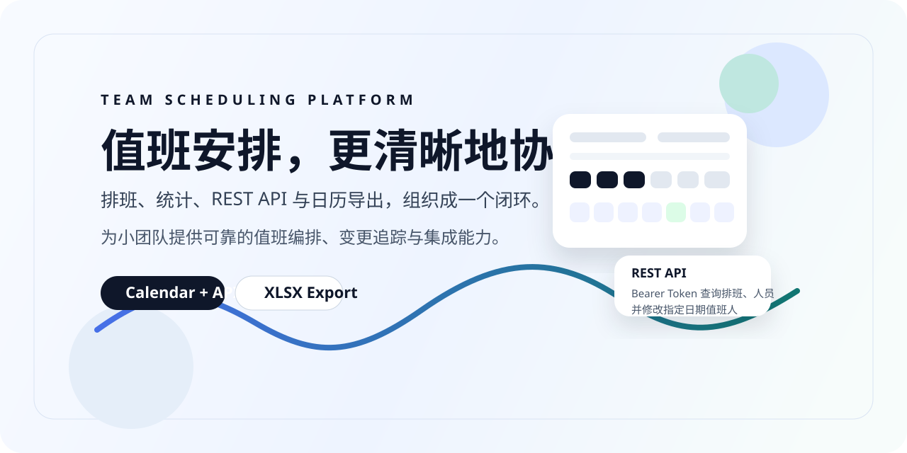
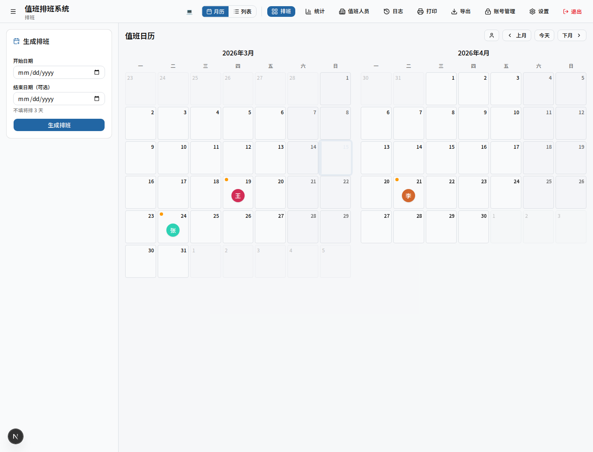
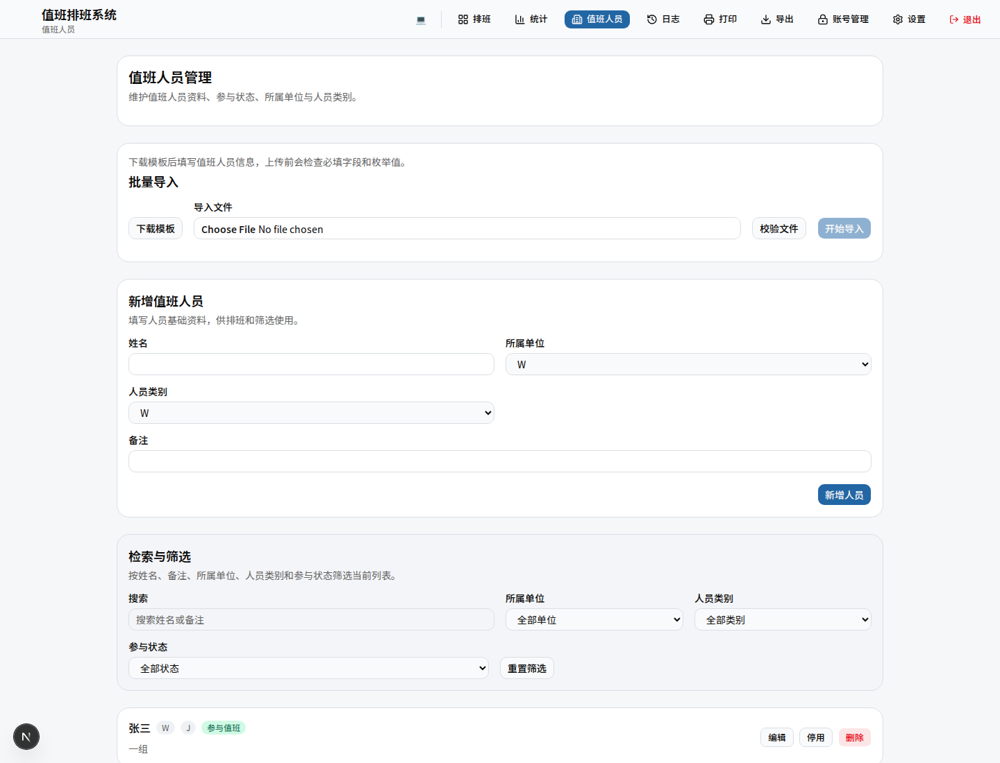
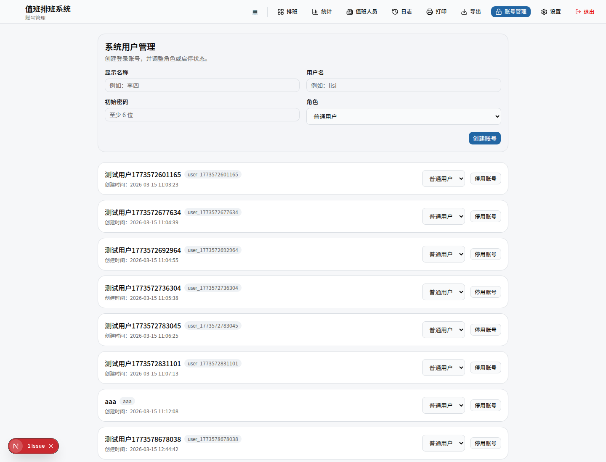
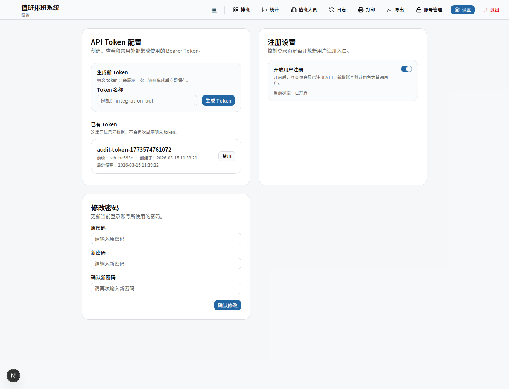
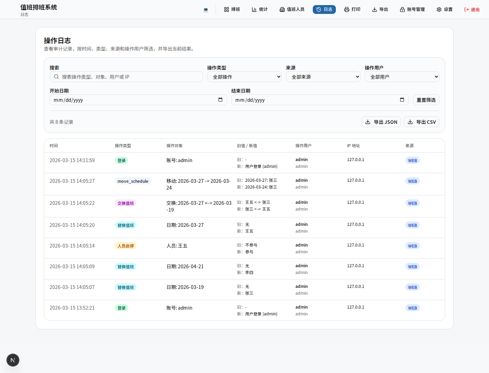

<p align="center">
  
</p>

<p align="center">
  <a href="https://github.com/zweien/scheduling/stargazers"></a>
  <a href="https://github.com/zweien/scheduling/network/members"></a>
  <a href="https://github.com/zweien/scheduling/blob/master/LICENSE"></a>
</p>

<p align="center">
  
  
  
  
  
  
  
</p>

<p align="center">
  一个面向团队内部使用的值班排班系统，覆盖月历排班、值班人员管理、审计日志、REST API、批量导入与多格式导出，并支持钉钉 OAuth2 登录与工作台集成。
</p>

适合内部值班、轮岗与轻量排班协作场景，重点解决排班生成、人工调整、集成对接和审计追踪这四类问题。

当前版本：

- `v1.14.2`

发布约定：

- GitHub Release 与 git tag 使用 `vX.Y.Z`
- 代码内回退版本使用 `package.json.version`

## 核心能力

- 双月月历与列表双视图，便于连续查看和值班回溯
- **值班员与值班领导双轨排班**，支持三种视图模式（值班员/领导/全部）
- 管理员 / 普通用户双角色权限模型，支持注册开关和账号管理
- 值班人员独立管理页面，支持单位、类别、备注、启停、筛选和批量导入
- **所属单位和人员类别可自定义配置**，支持在设置页面动态管理选项
- 月历支持桌面拖拽交换，也支持移动端”移动模式”调整排班
- **钉钉 OAuth2 登录**，支持扫码登录与工作台免登，与密码登录共存
- **法定节假日与休息日统计**，内置中国法定节假日数据，支持非工作日值班统计
- 审计日志记录操作用户、角色、IP 和来源，支持筛选、搜索、导出
- 提供 Bearer Token 保护的 REST API，适合第三方系统查询与修改排班
- 支持 CSV、JSON、XLSX 导出，其中 XLSX 为月历风格，便于打印和归档

## 系统截图

### 登录与排班

| 登录页 | 月历主界面 |
| --- | --- |
|  |  |

### 人员与账号

| 值班人员管理 | 账号管理 |
| --- | --- |
|  |  |

### 设置与审计

| 设置页 | 审计日志 |
| --- | --- |
|  |  |

## 适用场景

- 团队内部值班、轮岗、运维排班
- 需要保留人工调整记录和责任追踪的小团队
- 需要通过 API 与外部系统打通的内部工具
- 需要批量维护值班人员和定期导出归档的管理场景

## 功能概览

| 能力 | 说明 |
| --- | --- |
| 自动排班 | 按顺序循环生成指定时间范围的值班安排 |
| 月历视图 | 同时展示当前月与下个月，支持点击调整和移动端移动模式 |
| 列表视图 | 以时间线方式查看排班详情，显示日期、值班员、值班领导三列 |
| 值班领导 | 支持值班领导独立排班，可在三种视图模式间切换（值班员/领导/全部） |
| 手动调整 | 支持换人、删除、交换、移动到空日期 |
| 值班人员管理 | 支持单位、类别（可自定义）、备注、启停、搜索、筛选 |
| 字段配置 | 在设置页自定义所属单位和人员类别选项 |
| 批量导入 | 提供 XLSX 模板下载，导入前校验字段，按姓名更新或新增 |
| 账号与权限 | 管理员和普通用户双角色，支持注册开关 |
| 钉钉登录 | OAuth2 扫码登录与工作台免登，与密码登录共存，自动创建账号 |
| 节假日统计 | 内置中国法定节假日数据，统计非工作日（含周末）值班天数 |
| 审计日志 | 记录操作用户、角色、IP、来源，并支持搜索筛选导出 |
| REST API | Bearer Token 鉴权的排班、人员、Token 管理接口 |
| 导出能力 | 支持 CSV、JSON 与月历风格 XLSX |

## 快速开始

### 环境要求

- Node.js 20+
- npm

### 安装依赖

```bash
git clone https://github.com/zweien/scheduling.git
cd scheduling
npm install
```

### 本地运行

```bash
npm run dev
```

默认访问：

- `http://localhost:3000`

### 首次登录

系统会自动初始化一个默认管理员账号：

- 用户名：`admin`
- 密码：沿用系统配置中的初始密码

首次初始化数据库时，默认密码为：

- `123456`

如果本地数据库已经存在并被修改过，请以数据库中的当前密码为准。

### 可选环境变量

```env
SESSION_SECRET=your-secret-key-at-least-32-characters

# 钉钉 OAuth2 登录（可选）
DINGTALK_CLIENT_ID=your-dingtalk-client-id
DINGTALK_CLIENT_SECRET=your-dingtalk-client-secret
NEXT_PUBLIC_DINGTALK_CORP_ID=your-corp-id          # 工作台免登时需要
```

### 生产构建

```bash
npm run build
npm run start
```

## 登录与权限模型

当前系统支持账号密码登录和钉钉 OAuth2 登录两种方式。

### 密码登录

系统初始化时自动创建一个默认管理员账号（`admin` / `123456`）。

### 钉钉登录

配置钉钉相关环境变量后，登录页会显示"钉钉登录"按钮。支持两种模式：

- **扫码登录**：用户点击按钮跳转钉钉授权页面，扫码后自动登录
- **工作台免登**：配置 `NEXT_PUBLIC_DINGTALK_CORP_ID` 后，通过钉钉工作台打开应用时自动登录

首次钉钉登录会自动创建账号（角色为普通用户），后续登录自动关联已有账号。

### 角色权限

- `admin`
  - 管理值班人员
  - 管理系统账号
  - 生成和修改排班
  - 管理 API Token
  - 控制注册开关
- `user`
  - 查看排班、统计、日志
  - 使用打印和导出
  - 修改自己的密码

注册页可由管理员在设置页中开启或关闭。开启后，新注册用户默认角色为普通用户。

## 值班人员批量导入

值班人员管理页支持批量导入 `.xlsx` 文件。

导入流程：

1. 下载模板
2. 按模板填写人员信息
3. 上传后先做字段校验
4. 校验通过后再执行导入

模板字段：

- `姓名（必填）`
- `所属单位（必填，根据系统配置）`
- `人员类别（必填，根据系统配置）`
- `是否参与值班（必填，是/否）`
- `备注（选填）`

导入规则：

- 按姓名判重
- 同名存在则更新
- 同名不存在则新增
- 任意错误都会阻止导入

## 字段配置

从 v1.6.0 开始，所属单位和人员类别支持自定义配置。

### 配置管理

管理员可在**设置页面**自定义以下字段：

- **所属单位**：人员所属的组织/部门
- **人员类别**：人员的分类（如正式/临时等）

### 配置项属性

每个配置项包含：

- `value`：系统内部使用的标识符（如 `W`、`X`、`Z`）
- `label`：显示给用户的标签（可与 value 不同）
- `is_active`：是否启用（影响下拉选项显示）

### 使用场景

1. **添加新选项**：点击"添加"按钮，填写 value 和 label
2. **编辑选项**：点击列表中的项目进行修改
3. **删除选项**：点击删除按钮移除不再需要的选项
4. **排序**：拖拽列表项调整顺序

### 数据迁移

系统启动时会自动检查并创建 `config_options` 表：

- 默认初始化 `organization` 类型的 W/X/Z 选项
- 默认初始化 `category` 类型的 J/W 选项

现有数据库升级后自动保留所有数据，迁移过程不会丢失任何信息。

### 注意事项

- 删除配置项前，需确保没有值班人员使用该选项
- 配置变更后，导入模板会自动更新
- 建议在添加人员前先完成配置设置

## REST API

当前版本提供基于 Bearer Token 的最小集成能力。

### 鉴权方式

```http
Authorization: Bearer <your-token>
```

### 查询排班

```bash
curl "http://localhost:3000/api/schedules?start=2026-03-01&end=2026-03-31" \
  -H "Authorization: Bearer <your-token>"
```

### 修改指定日期排班

```bash
curl -X PATCH "http://localhost:3000/api/schedules/2026-03-16" \
  -H "Authorization: Bearer <your-token>" \
  -H "Content-Type: application/json" \
  -d '{"userId":2}'
```

### 查询人员

```bash
curl "http://localhost:3000/api/users" \
  -H "Authorization: Bearer <your-token>"
```

### 查询领导列表

```bash
curl "http://localhost:3000/api/leaders" \
  -H "Authorization: Bearer <your-token>"
```

### 查询领导排班

```bash
curl "http://localhost:3000/api/leader-schedules?start=2026-03-01&end=2026-03-31" \
  -H "Authorization: Bearer <your-token>"
```

### 修改指定日期领导排班

```bash
curl -X PATCH "http://localhost:3000/api/leader-schedules/2026-03-16" \
  -H "Authorization: Bearer <your-token>" \
  -H "Content-Type: application/json" \
  -d '{"leaderId":1}'
```

### 值班统计

按时间范围聚合每人值班次数，并附节假日维度分类（法定节假日 / 周末 / 调休补班）。时间参数三选一：`start`+`end`、`year` 或 `month`（自动处理闰年 2 月）。

```bash
# 查询 2026 全年（等价于 ?start=2026-01-01&end=2026-12-31）
curl "http://localhost:3000/api/schedules/stats?year=2026" \
  -H "Authorization: Bearer <your-token>"

# 查询某月：?month=2026-06
```

返回示例：

```json
{
  "range": { "start": "2026-01-01", "end": "2026-12-31" },
  "total": 4,
  "userCount": 2,
  "stats": [
    {
      "userId": 1,
      "userName": "张三",
      "count": 3,
      "restDayCount": 2,
      "holidayCount": 1,
      "adjustedWorkdayCount": 1,
      "dates": ["2026-01-01", "2026-01-04", "2026-01-10"],
      "restDays": [
        { "date": "2026-01-01", "name": "元旦", "type": "holiday" },
        { "date": "2026-01-10", "type": "weekend" }
      ]
    }
  ]
}
```

字段说明：

| 字段 | 含义 |
|---|---|
| `total` / `userCount` | 区间内总值班次数 / 涉及人数 |
| `count` | 该人员区间内值班天数 |
| `restDayCount` | 非工作日值班天数（法定节假日 + 周末 − 调休补班） |
| `holidayCount` | 法定节假日值班天数 |
| `adjustedWorkdayCount` | 调休补班值班天数 |
| `restDays` | 非工作日明细，`type` 为 `holiday`（带 `name`）或 `weekend` |

### Token 管理接口

- `GET /api/tokens`
- `POST /api/tokens`
- `PATCH /api/tokens/:id`

## Claude Code Skill

项目内置一个 Claude Code skill（`.claude/skills/scheduling-api/`），把上面的 REST API 封装成自然语言操作——在本仓库的 Claude Code 会话里直接说人话即可，无需手写 curl：

- 「查一下本周谁值班」
- 「把下周三的值班换成张三」
- 「统计今年每个人值班几次、节假日值班几次」
- 「导出本月值班表」

skill 通过 `.claude/skills/scheduling-api/scripts/api.sh` 调用 API，自动从 `.env` 读取 `SCHEDULING_API_TOKEN` 并注入 Bearer 鉴权。

### 一次性配置

```bash
cp .claude/skills/scheduling-api/assets/env.example .env
# 编辑 .env，填入浏览器里创建的 API token：
#   SCHEDULING_API_TOKEN=sch_...                     # 换班需 admin token
#   SCHEDULING_BASE_URL=http://localhost:3000        # 线上：https://scheduling.zweien.xyz
```

> Token 在 Web UI（登录 → Token 管理）创建。查询 / 统计 / 导出用任意 token；换班（PATCH）需 admin 角色。该 skill 仅在 Claude Code 会话中触发，`.env` 已被 gitignore，token 不入库。

## 审计与导出

### 节假日与休息日统计

系统运行时按年自动拉取中国法定节假日（数据源 [NateScarlet/holiday-cn](https://github.com/NateScarlet/holiday-cn)，基于国务院通知），内置 2025-2026 数据作为离线兜底。统计页支持：

- 按人员统计非工作日值班天数（含周末和法定节假日，排除调休补班日）
- 人员值班日期列表中标注节假日名称
- 节假日数据按年自动拉取，拉取失败时回退到内置数据

### 审计日志

日志页支持：

- 按日期范围筛选
- 按操作类型筛选
- 按来源筛选
- 按操作用户筛选
- 按关键字搜索
- 导出当前结果为 CSV / JSON

### 排班导出

当前支持三种格式：

- `CSV`
- `JSON`
- `XLSX`

XLSX 输出特性：

- 每个月一个 sheet
- 周一到周日 7 列布局
- 单元格显示日期、值班人、手动调整标记
- 适合 A4 横向打印和归档

## 部署

项目当前提供基于 `GitHub Actions + VPS + PM2 + Nginx` 的部署方案。

部署文档：

- [VPS 部署说明](docs/deployment/vps.md)

如果只想本地运行或内网部署，SQLite 已足够支撑小团队使用。

## 技术栈

- **框架：** Next.js 16 App Router
- **语言：** TypeScript
- **UI：** Tailwind CSS v4 + Base UI
- **数据库：** SQLite + better-sqlite3
- **认证：** iron-session
- **Excel：** ExcelJS
- **日期处理：** date-fns
- **测试：** Playwright + ESLint

## 项目结构

```text
src/
├── app/
│   ├── actions/              # Server Actions
│   │   └── game.ts           # 游戏得分与排行榜
│   ├── api/                  # REST API routes
│   │   └── auth/dingtalk/    # 钉钉 OAuth2 回调与工作台登录
│   ├── dashboard/            # Dashboard 各独立功能页面
│   ├── dingtalk/             # 钉钉工作台入口页
│   ├── register/             # 注册页
│   ├── layout.tsx            # 根布局
│   └── page.tsx              # 登录入口页
├── components/
│   ├── ui/                   # 基础 UI 组件
│   ├── WhackAMoleGame.tsx    # 打地鼠彩蛋游戏
│   └── *.tsx                 # 业务组件
├── lib/
│   ├── accounts.ts           # 系统账号模型
│   ├── auth.ts               # 登录与权限校验
│   ├── config-options.ts     # 字段配置管理
│   ├── db.ts                 # SQLite 初始化与迁移
│   ├── dingtalk.ts           # 钉钉 OAuth2 工具函数
│   ├── holidays.ts           # 法定节假日数据与判断函数
│   ├── logs.ts               # 审计日志
│   ├── schedules.ts          # 排班读写
│   ├── users.ts              # 值班人员管理
│   ├── export/               # 导出构建器
│   └── imports/              # 导入模板与解析
└── types/
    └── index.ts              # 领域类型
```

## License

MIT
